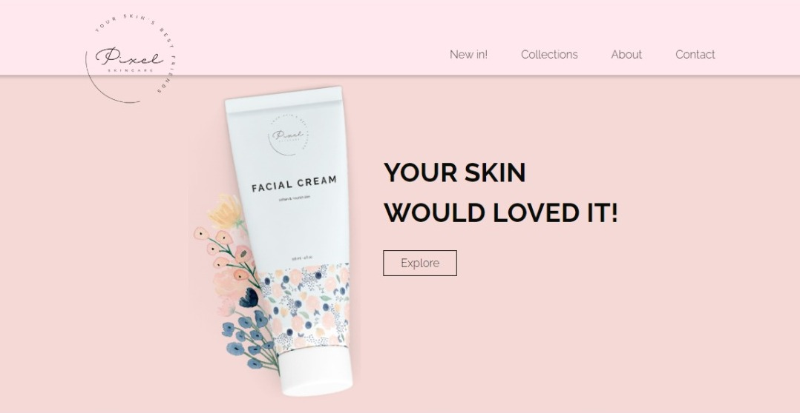

# Pixel Shop - 🌺

 
> 💖 <a href="https://monalizaps.github.pixel-shop">Acesse aqui</a> &nbsp; | &nbsp; 

## 💻 About

 Pixel shop
  

## 🧠 Techs

    
    
    

 

---

<table>
  <tr>
    <td>
      
    </td>
    <td>
    </td>
    <td>
      Feito por <a href="https://github.com/monaliza-pereira">Monaliza Pereira</a> 🔮
  </tr>
</table>
